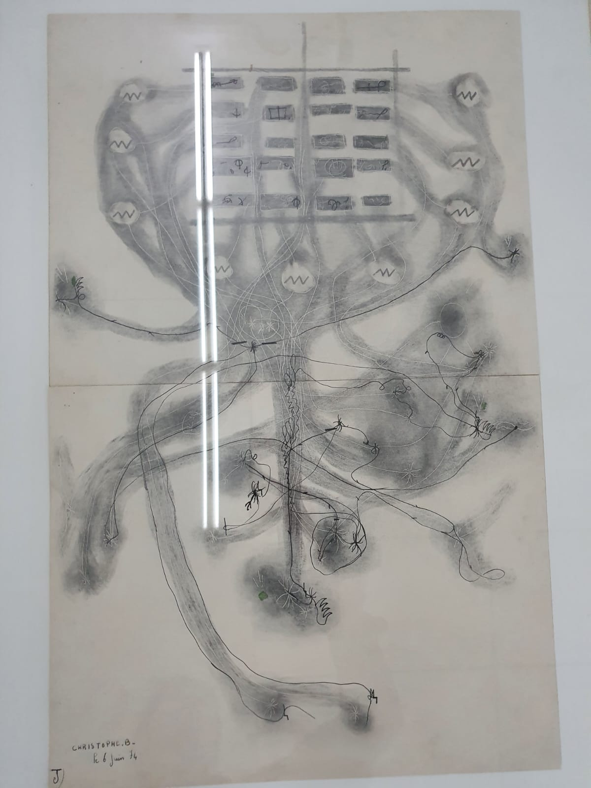
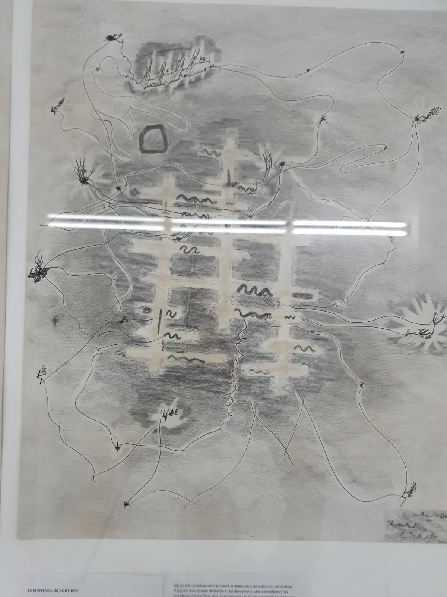

# pensamentos

Achei interessante a idéia de um mapa de navegação relacionado com os SSID das wifi que aparecem no percurso.

### "All space is occupied by the enemy. We are living under a permanent curfew. Not just the cops — the geometry"

In his manifesto for unitary urbanism, [Raoul Vaneigem](https://en.wikipedia.org/wiki/Raoul_Vaneigem "Raoul Vaneigem") articulated some further ideas behind the _dérive_ and the Situationist critique of space: "All space is occupied by the enemy. We are living under a permanent curfew. Not just the cops — the geometry".[[6]](https://en.wikipedia.org/wiki/D%C3%A9rive#cite_note-6) _Dérive_, as a previously conceptualized tactic in the French military, was "a calculated action determined by the absence of a greater locus", and "a maneuver within the enemy's field of vision".[[7]](https://en.wikipedia.org/wiki/D%C3%A9rive#cite_note-7) To the SI, whose interest was inhabiting space, the _dérive_ brought appeal in this sense of taking the "fight" to the streets and truly indulging in a determined operation.

-

A video documentary combining exhibition footage of the Situationist International exhibitions with film footage of the 1968 Paris student uprising, and graffiti and slogans based on the ideas of Guy Debord (one of the foremost spokesmen of the Situationist International movement). 

-

## Wikipedia

A 2004 poster announcing a large-scale _dérive_ in London, led by a [psychogeographical](https://en.wikipedia.org/wiki/Psychogeography "Psychogeography") society

> The sudden change of ambiance in a street within the space of a few meters; the evident division of a city into zones of distinct psychic atmospheres; the [path of least resistance](https://en.wikipedia.org/wiki/Path_of_least_resistance "Path of least resistance") that is automatically followed in aimless strolls (and which has no relation to the physical contour of the terrain); the appealing or repelling character of certain places—these phenomena all seem to be neglected. In any case they are never envisaged as depending on causes that can be uncovered by careful analysis and turned to account.
> 
> — Guy Debord, _Introduction to a Critique of Urban Geography_[[5]](https://en.wikipedia.org/wiki/D%C3%A9rive#cite_note-Debord1955Introduction-5)

_Dérives_ are necessary, according to Situationist theory, because of the increasingly predictable and monotonous experience of [everyday life](https://en.wikipedia.org/wiki/Everyday_life "Everyday life") in [advanced capitalism](https://en.wikipedia.org/wiki/Advanced_capitalism "Advanced capitalism").

--

### [psychogeography](https://en.wikipedia.org/wiki/Psychogeography "Psychogeography")
"specific effects of the geographical environment (whether consciously organized or not) on the emotions and behavior of individuals."

--

Space is not a scientific object removed from ideology or politics; it has always been political and strategic (…) Space has been shaped and molded from historical and natural elements; but this has been a political process. Space is both political and ideological. (…) It is a product literally filled with ideologies (1976: 31).

--

**Psy-Geo-Conflux** (better known as **Conflux**) is an annual [New York City](https://en.wikipedia.org/wiki/New_York_City "New York City") festival dedicated to [psychogeography](https://en.wikipedia.org/wiki/Psychogeography "Psychogeography"), where visual, performance and sound artists, writers, urban adventurers, researchers and the public gather for four days to explore the physical and psychological landscape of the city.

**PSY-GEO-CONFLUX**  
THURS.-SUN., MAY 13-16

FRANCE, 1955: Situationist Guy Debord defines the new field of psychogeography as "the study of the precise laws and specific effects of the geographical environment, consciously organized or not, on the emotions and behaviors of individuals."

Sound like a recipe for disaster? Or the caption of your day-to-day? Then come join psychogeographers at work and play this weekend, as the second annual Psy-Geo-Conflux convenes around the city. Presented by Glowlab and Participant, Inc., Conflux events range from Lower East Side techno-drifts to a Fugitive Love Hunt in Central Park, and include a chess game played on South Williamsburg streets using human pieces moved via cellphone.

Co-organizer David Mandl calls psychogeography a "utopian way of making our urban place more passionate and exciting." He cites the field's 50s originators, "the artists and hardcore lefties who would explore Paris using another city's map, or drift aimlessly to experience places they saw all the time in new ways."

This year's city overlayers navigate Manhattan with a map of Copenhagen provided by participants from that city (others hail from Rotterdam, Berlin, Lisbon, San Francisco). Julian **Bleecker wanders for WiFi nodes (wireless Internet connections) while composing haikus from the nodes' SSID names.**

Mandl and co-organizer Christina Ray (Glowlab's founder) present One Block Radius, a multimedia survey of the Bowery block where the New Museum will build its big new facility later this year. With copious photos, videos and scavenged objects, they've compiled "not only physical data," says Ray, "but also unusual and quirky data: how many bottle caps we saw or what the weather was like on a particular day. It's a guidebook, but we crammed as much information as you usually get on a whole city from a single block."

A 24-hour, five-borough roadtrip maps progress on a website, allowing participants to join up for, say, a fishing break. Most events take about two hours, out and back from the Conflux's HQ on Rivington St. Categories include "Navigate" for mobile activities and "Speak" for lectures. "Strike" covers street actions like Mobile Coffee Unit, distributing free coffee and engaging in random conversations, and Yankee Game Walk, which has Lee Walton responding to a headphone broadcast, "a wildly choreographed performance piece dictated by the Yankees game," according to Mandl. That the source of Walton's antics may be lost on passersby is no surprise for psychogeographers, as they both undermine and expand our common sense of place.

_Participant, Inc., 95 Rivington St. (betw. Orchard & Ludlow Sts.), 212-254-4334, schedule at  
psygeocon.org._

--

“Psychogeography is the fact that you have an opinion about a space the moment you step into it,” says the writer and psychogeographer Wilfried Hou Je Bek. “This has as much to do with the space as with our hardwired instincts to determine if it is safe.”

Graphy comes from the Greek graphein (to write), a decidedly polysemic word. If geographers “carve,” “draw,” or “write” the earth (geos), what about psychogeographers? The Latin prefix psyche (breath) adds a zest of soul to the mix, linking earth, mind and foot. Psychogeographic writing can be thought of as an alternative way of reading the city. Wilfried Hou Je Bek calls it “the city-space cut-up.” Just as William Burroughs and Brion Gysin cut and reorganized newspaper texts to reveal their implicit content, so too psychogeographers decode urban space by moving through it in unexpected ways.

--

--

### APPLICATIVO
A smartphone app named Dérive was developed in the 21st century by a team including Eduardo Cachucho and Babak Fakhamzadeh. The smartphone app shows a series of simple geography-based directions on a mobile device's screen such as "follow a red vehicle" to create the _dérive_ experience.[[8]](https://en.wikipedia.org/wiki/D%C3%A9rive#cite_note-8)

There is also a similar application with the same name from a Russian developer who does not require installation and works directly in a browser with an additional mapping drift mode, where the application generates a point on the map to move to.[[9]](https://en.wikipedia.org/wiki/D%C3%A9rive#cite_note-9)

In March 2020, an iOS and Android app called [Randonautica](https://en.wikipedia.org/wiki/Randonautica "Randonautica") launched and cited [Guy Debord's](https://en.wikipedia.org/wiki/Guy_Debord "Guy Debord") essay on _dérive_ as a core inspiration. It uses a [random number generator](https://en.wikipedia.org/wiki/Random_number_generator "Random number generator") to seed a random map location that the user is prompted to walk to while holding an intention in mind.[[10]](https://en.wikipedia.org/wiki/D%C3%A9rive#cite_note-10)

---

### Poetic Terrorism

Weird dancing in all-night computer-banking lobbies. Unauthorized pyrotechnic displays. Land-art, earth-works as bizarre alien artifacts strewn in State Parks. Burglarize houses but instead of stealing, leave Poetic-Terrorist objects. Kidnap someone & make them happy. Pick someone at random & convince them they’re the heir to an enormous, useless & amazing fortune — say 5000 square miles of Antarctica, or an aging circus elephant, or an orphanage in Bombay, or a collection of alchemical mss. **Later they will come to realize that for a few moments they believed in something extraordinary, & will perhaps be driven as a result to seek out some more intense mode of existence.**

Bolt up brass commemorative plaques in places (public or private) where you have experienced a revelation or had a particularly fulfilling sexual experience, etc.

Go naked for a sign.

Organize a strike in your school or workplace on the grounds that it does not satisfy your need for indolence & spiritual beauty.

Grafitti-art loaned some grace to ugly subways & rigid public momuments — PT-art can also be created for public places: poems scrawled in courthouse lavatories, small fetishes abandoned in parks & restaurants, xerox-art under windshield-wipers of parked cars, Big Character Slogans pasted on playground walls, anonymous letters mailed to random or chosen recipients (mail fraud), **pirate radio transmissions,** wet cement...

The audience reaction or aesthetic-shock produced by PT ought to be at least as strong as the emotion of terror — powerful disgust, sexual arousal, superstitious awe, sudden intuitive breakthrough, dada-esque angst — no matter whether the PT is aimed at one person or many, no matter whether it is “signed” or anonymous, if it does not change someone’s life (aside from the artist) it fails.

PT is an act in a Theater of Cruelty which has no stage, no rows of seats, no tickets & no walls. In order to work at all, PT must categorically be divorced from all conventional structures for art consumption (galleries, publications, media). Even the guerilla Situationist tactics of street theater are perhaps too well known & expected now.

An exquisite seduction carried out not only in the cause of mutual satisfaction but also as a conscious act in a deliberately beautiful life — may be the ultimate PT. The PTerrorist behaves like a confidence-trickster whose aim is not money but CHANGE.

Don’t do PT for other artists, do it for people who will not realize (at least for a few moments) that what you have done is art. Avoid recognizable art-categories, avoid politics, don’t stick around to argue, don’t be sentimental; be ruthless, take risks, vandalize only what must be defaced, do something children will remember all their lives — but don’t be spontaneous unless the PT Muse has possessed you.

Dress up. Leave a false name. Be legendary. The best PT is against the law, but don’t get caught. Art as crime; crime as art. 

---

## Publications

The only member of the Situationist International to remain at its dissolution in 1972 was Guy Debord (1931–1994). He is often held to be synonymous with the movement, but anti-Debordist accounts rightly stress the role of others, such as Asger Jorn (1914–1973) or Constant Nieuwenhuys (1920–2005) who both left the movement as it headed out of its “aesthetic” phase towards its ostensibly more “political” one. Take, for example, Constant’s extraordinary New Babylon project, which he began while a member of the Situationist International and continued independently after separating from it. Constant imagined an entirely new landscape for the earth, one devoted entirely to play. But New Babylon is a landscape that began from the premise that the transition to this new landscape is a secondary problem. Play is one of the key categories of Situationist thought and practice, but would it really be possible to bring this new landscape for play into being entirely by means of play itself?

--

### The photos bellow were taken by aurelia during her visit to an exhibition. The drawings have a relation to the body moving in the space. The result of some sort of workshop in a psychiatric situation.

"Lignes d'erre" Fernand Deligny et les présences proches.

--

On a dérive one or more persons drop their relations, their work and leisure activities, and all their other usual motives for movement and action, and let themselves be drawn by the attractions of the terrain and the encounters they find there.

Guy Debord – Theory of the Dérive, Internationale Situationniste No. 2

--

https://www.widewalls.ch/magazine/situationism-influence-history

# How did Situationism Influence Art History?

It is rare for an art movement to be completely original. The _go forward_ meanings of [avant-garde](https://www.widewalls.ch/magazine/avant-garde-movement-theater-music-photography-contemporary-art/) do not mean that its movements are a _tabula rasa_ and this is certainly true for **Situationism**. Spurred by many previous concepts, this artistic and political movement started emerging during the early 1960s in France and it experimented with the idea of _constructing a situation_ - hence the name. Constructing a situation was setting up an environment favorable for the fulfillment of a particular desire. This was the main concept for all representatives of Situationism[1]. All of the initial theories concerning the development of this movement came from an organization called **Situationist International** (often referred to simply as **SI**) - a group whose activities we shell investigate to detail in the remainder of this text.

# Critic on the Political Practice of Détournement

https://www.stedelijk.nl/en/digdeeper/critic-political-practice-detournement

--

Art Sabotage

Art sabotage strives to be perfectly exemplary but at the same time retain an element of opacity — not propaganda but aesthetic shock — apallingly direct yet also subtly angled — action-as-metaphor.

Art Sabotage is the dark side of Poetic Terrorism — creation-through-destruction — but it cannot serve any Party, nor any nihilism, nor even art itself. Just as the banishment of illusion enhances awareness, so the demolition of aesthetic blight sweetens the air of the world of discourse, of the Other. Art Sabotage serves only consciousness, attentiveness, awakeness...

--

--

